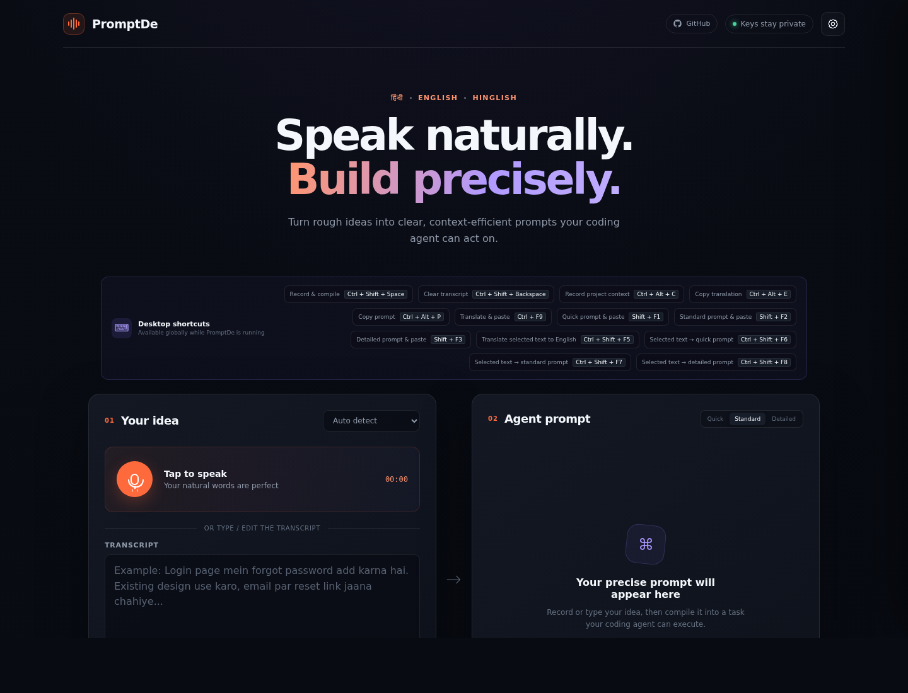
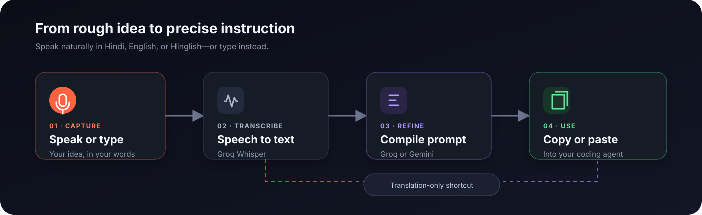

<div align="center">
  
  <h1>PromptDe</h1>
  <p><strong>Speak naturally. Build precisely.</strong></p>
  <p>Turn rough Hindi, English, or Hinglish ideas into clear prompts your coding agent can act on.</p>
  <p>
    <a href="https://github.com/ITISH7/PromptDe/actions/workflows/ci.yml"></a>
    <a href="https://github.com/ITISH7/PromptDe/releases/latest"></a>
    <a href="LICENSE"></a>
    
    
  </p>
  <p>
    <a href="https://github.com/ITISH7/PromptDe/releases/latest">Download</a> ·
    <a href="#install-promptde">Installation</a> ·
    <a href="#keyboard-shortcuts">Shortcuts</a> ·
    <a href="LICENSE">MIT License</a>
  </p>
</div>



## What is PromptDe?

PromptDe is a local voice-to-prompt utility for developers. Say a task the way it comes to you—even if you mix Hindi and English—and PromptDe turns it into a structured English prompt ready for a coding agent.

For example:

> **You say:** “Login page mein forgot password add karna hai. Existing design use karo.”
>
> **PromptDe produces:** “Add a forgot-password flow to the existing login page. Reuse the current design system and preserve the page's established visual patterns.”

You can also translate speech, rewrite selected text, and paste the result directly into the application you are using. Prefer typing? The same workflow works without a microphone.

## How it works



1. **Speak or type** your idea in Hindi, English, or Hinglish.
2. **Transcribe** speech with Groq Whisper.
3. **Choose the result:** translate the text, or compile it into a Quick, Standard, or Detailed prompt with Groq or Gemini.
4. **Copy or paste** the result into your coding agent, editor, browser, or any other app.

## Why use it?

- **Keep your train of thought:** describe a task faster than you can format it.
- **Speak naturally:** mixed Hindi and English are welcome.
- **Give agents better context:** add project details and choose how much structure the prompt needs.
- **Work across applications:** desktop shortcuts can process speech or selected text and paste the result at your cursor.
- **Bring your own keys:** use your own Groq and optional Gemini API keys.
- **Stay local by default:** the interface and server run on your machine; only provider requests are sent to the selected AI service.

### Prompt modes

| Mode | Best for | Result |
| --- | --- | --- |
| **Quick** | Small, obvious changes | A short, direct instruction |
| **Standard** | Most coding tasks | A clear goal, context, and expected outcome |
| **Detailed** | Complex or risky work | Requirements, constraints, steps, and acceptance checks |

## Install PromptDe

The desktop app includes everything needed to run PromptDe. You do not need Node.js, npm, or Git unless you install from source.

### Linux

For 64-bit Intel/AMD Linux:

```bash
curl -fsSL https://github.com/ITISH7/PromptDe/releases/latest/download/install-promptde-linux.sh | sh
```

The installer downloads the latest AppImage, adds PromptDe to your application menu, and checks the shortcut helpers required by your X11 or Wayland session. Installing missing system packages may ask for administrator access.

Set `PROMPTDE_SKIP_SYSTEM_DEPENDENCIES=1` before running the installer only if you manage those packages yourself.

### Windows

[Download PromptDe for Windows](https://github.com/ITISH7/PromptDe/releases/latest/download/PromptDe-Setup-x64.exe) (Windows 10 or newer, 64-bit), then open the installer.

The per-user installer does not require administrator access. Current Windows builds may be unsigned, so your browser or Windows SmartScreen can show a warning:

- If the browser warns that the download is not commonly downloaded, choose **Keep**.
- If Windows SmartScreen shows “Windows protected your PC,” choose **More info**, then **Run anyway**.

<details>
<summary>Optional PowerShell installer</summary>

```powershell
$script = "$env:TEMP\install-promptde.ps1"
Invoke-WebRequest -UseBasicParsing https://raw.githubusercontent.com/ITISH7/PromptDe/HEAD/scripts/install-desktop.ps1 -OutFile $script
powershell.exe -NoProfile -ExecutionPolicy Bypass -File $script
```

</details>

### macOS

- [Apple Silicon](https://github.com/ITISH7/PromptDe/releases/latest/download/PromptDe-mac-arm64.dmg) (M1 and newer)
- [Intel Mac](https://github.com/ITISH7/PromptDe/releases/latest/download/PromptDe-mac-x64.dmg)

Open the DMG and drag PromptDe into **Applications**. Current Mac builds are not notarized, so the first launch may require you to Control-click the app, choose **Open**, and confirm.

If macOS blocks PromptDe or reports that the app cannot be opened, remove the quarantine attribute and launch the installed application:

```sh
xattr -dr com.apple.quarantine /Applications/PromptDe.app
open /Applications/PromptDe.app
```

If desktop shortcuts cannot copy selected text or paste generated text, enable both permissions and then quit and reopen PromptDe:

- **System Settings → Privacy & Security → Accessibility → PromptDe**
- **System Settings → Privacy & Security → Automation → PromptDe → System Events**

### Install from source

You need [Node.js](https://nodejs.org/) 22.12 or newer and a Groq API key.

```bash
git clone https://github.com/ITISH7/PromptDe.git
cd PromptDe
npm ci
cp .env.example .env
npm start
```

Add your key to `.env`:

```dotenv
GROQ_API_KEY=gsk_your_groq_api_key_here
GEMINI_API_KEY=your_optional_gemini_api_key_here
PORT=4173
```

Then open [http://127.0.0.1:4173](http://127.0.0.1:4173). To run the Electron desktop app instead, use `npm run desktop`.

On Debian/Ubuntu, install the helpers for your display server if you want system-wide paste shortcuts:

```bash
# X11
sudo apt install xdotool x11-utils

# Wayland
sudo apt install wtype xdg-desktop-portal
```

If a compositor blocks automatic paste, PromptDe leaves the generated text on your clipboard.

## First use

1. Open **Settings** and add a Groq API key. Groq is required for voice transcription and is the default prompt compiler.
2. Optionally add a Gemini API key and select Gemini as the compiler.
3. Choose a language or leave language detection on **Auto**.
4. Speak or type an idea, add optional project context, and choose a prompt mode.
5. Select **Compile my prompt**, review the result, and copy it to your agent.

You can get a [Groq API key](https://console.groq.com/keys) and, if wanted, a [Gemini API key](https://aistudio.google.com/app/apikey).

## Keyboard shortcuts

Desktop shortcuts work while PromptDe is running. Press a recording shortcut once to start and again to stop and process the recording.

| Action | Windows/Linux | macOS |
| --- | --- | --- |
| Show, record, and compile | `Ctrl+Shift+Space` | `Cmd+Shift+Space` |
| Clear the transcript | `Ctrl+Shift+Backspace` | `Cmd+Shift+Backspace` |
| Record project context | `Ctrl+Alt+C` | `Cmd+Option+C` |
| Copy the English interpretation | `Ctrl+Alt+E` | `Cmd+Option+E` |
| Copy the compiled prompt | `Ctrl+Alt+P` | `Cmd+Option+P` |
| Record, translate, and paste | `Ctrl+F9` | `Cmd+F9` |
| Record a Quick prompt and paste | `Shift+F1` | `Shift+F1` |
| Record a Standard prompt and paste | `Shift+F2` | `Shift+F2` |
| Record a Detailed prompt and paste | `Shift+F3` | `Shift+F3` |
| Translate selected text to English | `Ctrl+Shift+F5` | `Cmd+Shift+F5` |
| Selected text → Quick prompt | `Ctrl+Shift+F6` | `Cmd+Shift+F6` |
| Selected text → Standard prompt | `Ctrl+Shift+F7` | `Cmd+Shift+F7` |
| Selected text → Detailed prompt | `Ctrl+Shift+F8` | `Cmd+Shift+F8` |

Shortcut values can be changed with the `PROMPTDE_*_SHORTCUT` variables shown in [.env.example](.env.example).

## API keys and privacy

- **Web app:** keys entered in Settings live only in browser session storage and are cleared when the tab closes. The server does not persist them.
- **Desktop app:** keys are stored in PromptDe's local configuration `.env`. Use **Settings → Open configuration folder** to find it.
- **Provider calls:** audio is sent to Groq for transcription. Prompt text is sent to the compiler you select—Groq or Gemini.
- **Repository safety:** `.env` files are ignored by Git. Never commit real credentials.

If both compiler keys are configured, PromptDe can fall back to the other provider after a temporary compiler error.

## Development

PromptDe uses Node.js ES modules, the built-in HTTP server, plain HTML/CSS/JavaScript, and Electron.

```bash
npm ci          # install exact dependencies
npm run lint    # validate server, browser, desktop, and test code
npm test        # run integration tests without making provider API calls
npm run desktop # launch the desktop app in development mode
```

<details>
<summary>Build desktop packages</summary>

```bash
npm run pack:linux
npm run pack:windows
npm run pack:windows:portable
npm run pack:mac
```

Linux builds produce AppImage and Debian packages. Windows builds produce an NSIS installer or portable ZIP. macOS builds must run on macOS and produce Intel and Apple Silicon DMGs. Output is written to `dist/`.

</details>

### Project structure

```text
.
├── desktop/             Electron main process, launcher, and preload bridge
├── public/              Browser interface
├── docs/images/         README screenshots and diagrams
├── scripts/             Install and packaging helpers
├── test/                Node integration tests
├── server.mjs           Local HTTP server and provider integrations
└── package.json         npm scripts and desktop packaging configuration
```

## Contributing

Contributions are welcome. Read [CONTRIBUTING.md](CONTRIBUTING.md) for setup and pull-request guidance, and follow the [Code of Conduct](CODE_OF_CONDUCT.md).

- Report bugs or request features with the [GitHub issue forms](https://github.com/ITISH7/PromptDe/issues/new/choose).
- Report vulnerabilities privately using the [security policy](SECURITY.md).
- See planned work in the [roadmap](ROADMAP.md) and released changes in the [changelog](CHANGELOG.md).
- For installation help, start with the [support guide](SUPPORT.md).

## License

PromptDe is available under the [MIT License](LICENSE).
